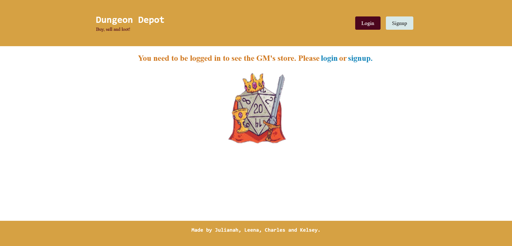
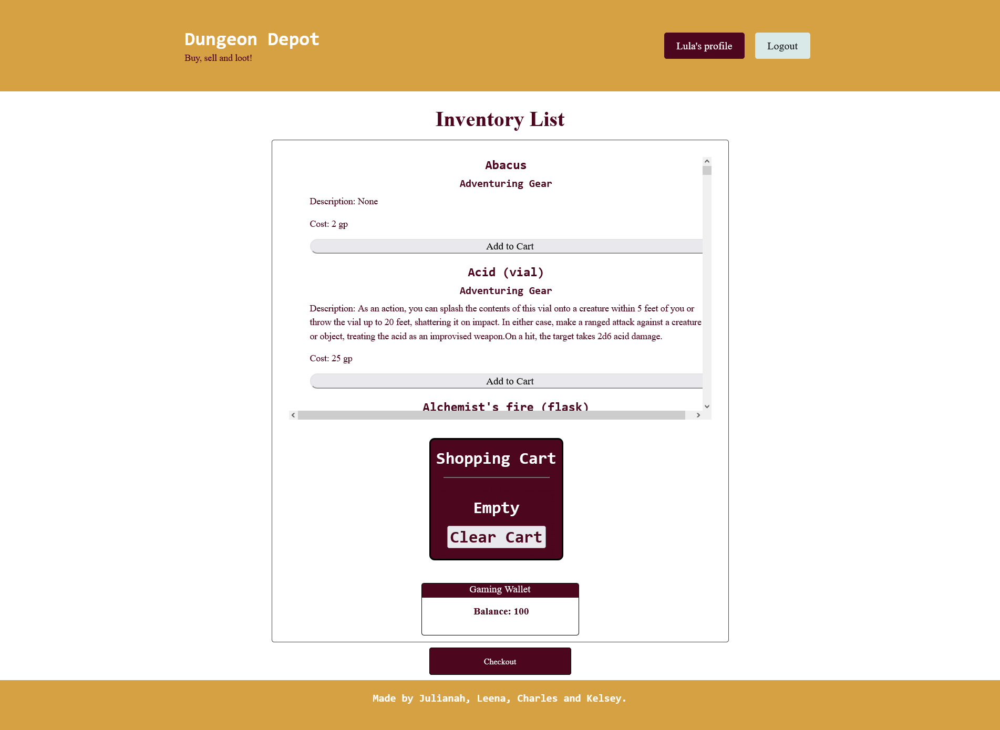
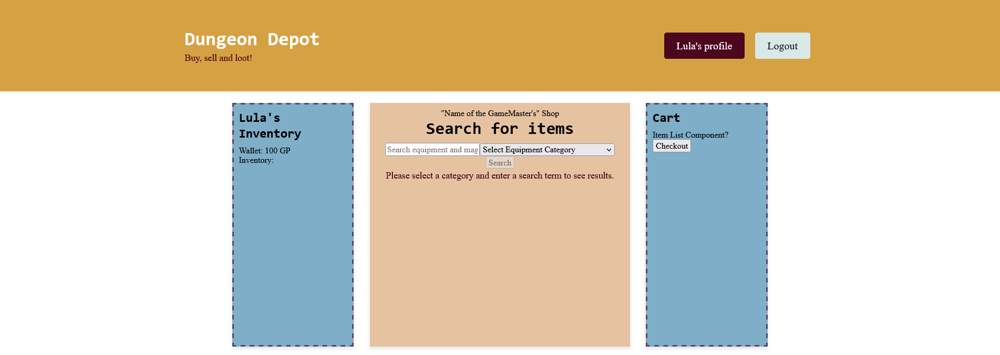

# DungeonDepot

## Description
Dungeon Depot is a web app, that helps Game Masters (GM) reduce the workload of running a Dungeons &amp; Dragons campaign. 

## Overview

Create a GM account and start creating stores, you can search for specific item and add it to your store. 

Create an User account and access your GMs stores, you will have a wallet and you can buy from the GM's Store. You purchased items will be added to your inventory. 

## Usage

Run the web app from here: [DUNGEON DEPOT](https://dungeondepot.onrender.com)

## Screenshots

## Features

What's next?

Dungeon Depot is an app in development and we still want to add more features, like:

- [ ] Creating random stores based on type of equipment or rarity. 
- [ ] Make it downloadble and installable
- [ ] Improve UX

## Credits

Thanks to [5e-srd-api ](https://github.com/5e-bits/5e-srd-api) to provides us an API to create this. 

## Contributing

Pull request are welcome! If you'd like to contribute to the project simply fork the repo, work on your changes and then submit a pull request. We are open for suggestions to improve this project, if you want to help please take a look around the [current issues](https://github.com/LeenaCruz/DungeonDepot/issues)! 